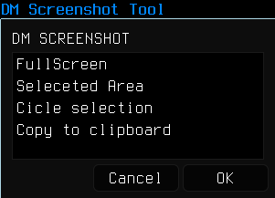

# Screenshot tool

This tool, makes easy to take an screenshot (fullscreen, window, rectangle, circle and clipboard) and have the preview instananeously.
Even if you don't save the image you have the image copied to clipboard.

## Required packages

* xdotool
* maim
* xclipboard
* zenity
* sxiv
* imagemagick
* xinput

## Archlinux installation

```bash
sudo pacman -S xdotool maim xclip sxiv zenity imagemagick xorg-xinput
```

## Ubuntu (18.04 or higher) installation

zenity it's already installed.

```bash
sudo apt update && sudo apt upgrade
sudo apt install xdotool maim sxiv xclip imagemagick xinput
```

## Fullscreen, Selection, Circle Selection and Copy to Clipboard

* Capture the fullscreen.
* You can select a window or a rectangle area, if you press in the desktop it will capture a fullscreen.
* Circle selection, you need to click at the center of the image you want to trim and then click to the desire distance (circumference). 
* Copy the image you have taken to clipboard even, this work for every option.

## Usage
```bash
xinput -list
```
Select the mouse ID e.g. ↳ Logitech M280/320/275 id=11[slave  pointer  (2)]
In case you want to capture a circle you must click mouse button[2] (scrollbar button).
Window or rectangle selection works only with left mouse button[1].
```bash
chmod +x screenShot.sh
./screenshot
```

## Images taken with Screenshot tool.

Fullscreen image


Selected area image




Selected window image


Circle image


